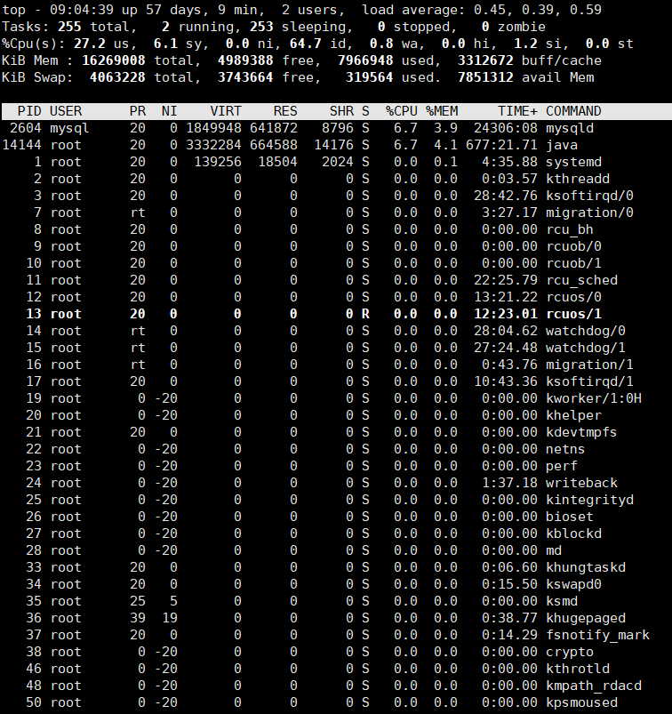
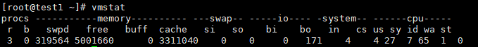
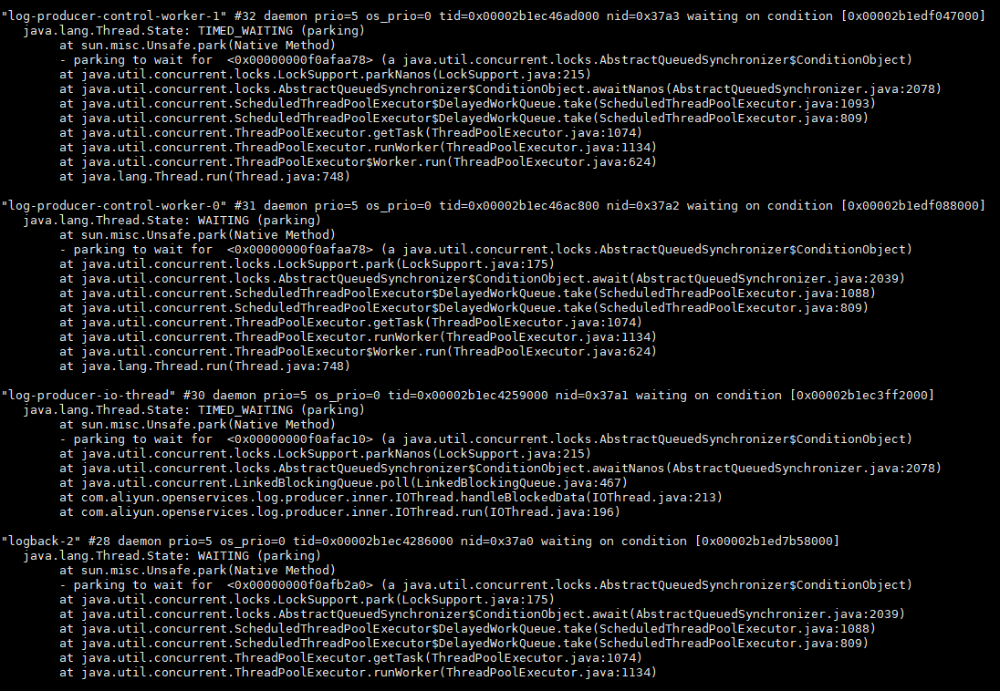
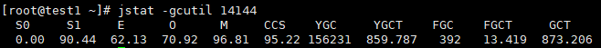

## JVM性能调优的思路
 
### 一、性能分析  

#### 1. CPU分析  

top vmstat ps  
查看系统的cpu使用率是否有异常  

**top**  

**vmstat** (主要关注us-用户进程所占的百分比)  

当us接近100%甚至更高时，可以确定是cpu繁忙造成的响应缓慢    
一般说来，cpu繁忙的原因有以下几个：

>1.线程中有无限空循环、无阻塞、正则匹配或者单纯的计算  
>2.发生了频繁的gc  
>3.多线程的上下文切换  

jstack [pid]  
用于打印出异常进程的堆栈信息  
  
  
jstat -gcutil [pid]  
查看对应进程的gc信息   

  
#### 2. 内存分析  
  
堆内内存-Java应用主要的内存区域,通常与这部分内存性能相关的有：

>创建的对象：这个是存储在堆中的，需要控制好对象的数量和大小，尤其是大的对象很容易进入老年代  
>全局集合：全局集合通常是生命周期比较长的，因此需要特别注意全局集合的使用  
>缓存：缓存选用的数据结构不同，会很大程序影响内存的大小和gc  
>ClassLoader：主要是动态加载类容易造成永久代内存不足  
>多线程：线程分配会占用本地内存，过多的线程也会造成内存不足    
  
堆内内存使用不当很容易造成：

>频繁GC -> Stop the world，使你的应用响应变慢  
>OOM，直接造成内存溢出错误使得程序退出。OOM又可以分为以下几种:  
>>Heap space：堆内存不足  
>>PermGen space：永久代内存不足  
>>Native thread：本地线程没有足够内存可分配  
  
排查堆内存问题的常用工具是jmap，是jdk自带的。一些常用用法如下：  

>查看jvm内存使用状况：jmap -heap  
>查看jvm内存存活的对象：jmap -histo:live  
>把heap里所有对象都dump下来，无论对象是死是活：jmap -dump:format=b,file=xxx.hprof  
>先做一次full GC，再dump，只包含仍然存活的对象信息：jmap -dump:format=b,live,file=xxx.hprof  

#### 3. IO分析  

##### a. 文件IO  

pidstat iostat vmstat  
用于查看io的状况  

##### b. 网络IO  

netstat -anp  
查看所有连接的状况、数目、端口信息等（当time_wait或者close_wait连接过多时，会影响应用的相应速度）  

tcpdump -i eth0 -w tmp.cap -tnn dst port 8080  
监听8080端口的网络请求并打印日志到tmp.cap中  

cat /proc/interrupts  
可以获取当前系统使用的中断的情况  

#### 4. 其他分析工具  
**VisualVM**  一款java应用监测工具,能够看到jvm上的线程、内存、类等信息  
**Java Mission Control(jmc)**  一款采样型的集诊断、分析和监控与一体的非常强大的工具  
**Btrace**  它使用java attach api+ java agent + instrument api能够实现jvm的动态追踪。在不重启应用的情况下可以加入拦截类的方法以打印日志等  
**Jwebap**  一款JavaEE性能检测框架，基于asm增强字节码实现。支持：http请求、jdbc连接、method的调用轨迹跟踪以及次数、耗时的统计

### 二、性能调优  

#### 1. CPU调优
几点建议：  
>不要存在一直运行的线程(无限while循环)，可以使用sleep休眠一段时间。这种情况普遍存在于一些pull方式消费数据的场景下，当一次pull没有拿到数据的时候建议sleep一下，再做下一次pull。  
>轮询的时候可以使用wait/notify机制  
>避免循环、正则表达式匹配、计算过多，包括使用String的format、split、replace方法(可以使用apache的commons-lang里的StringUtils对应的方法)，使用正则去判断邮箱格式(有时候会造成死循环)、序列/反序列化等。  
>结合jvm和代码，避免产生频繁的gc，尤其是full GC。  

此外，使用多线程的时候，还需要注意以下几点：  

>使用线程池，减少线程数以及线程的切换
>多线程对于锁的竞争可以考虑减小锁的粒度(使用ReetrantLock)、拆分锁(类似ConcurrentHashMap分bucket上锁), 或者使用CAS、ThreadLocal、不可变对象等无锁技术。此外，多线程代码的编写最好使用jdk提供的并发包、Executors框架以及ForkJoin等，此外Discuptor和Actor在合适的场景也可以使用。

#### 2. 内存调优
内存的调优主要就是对jvm的调优。

>合理设置各个代的大小。避免新生代设置过小(不够用，经常minor gc并进入老年代)以及过大(会产生碎片)，同样也要避免Survivor设置过大和过小。  
>选择合适的GC策略。需要根据不同的场景选择合适的gc策略。这里需要说的是，cms并非全能的。除非特别需要再设置，毕竟cms的新生代回收策略parnew并非最快的，且cms会产生碎片。此外，G1直到jdk8的出现也并没有得到广泛应用，并不建议使用。  
>jvm启动参数配置-XX:+PrintGCDetails -XX:+PrintGCDateStamps -Xloggc:[log_path]，以记录gc日志，便于排查问题。  

对于第一点，具体的还有一点建议：

>年轻代大小选择：响应时间优先的应用，尽可能设大，直到接近系统的最低响应时间限制（根据实际情况选择）。在此种情况下，年轻代收集发生gc的频率是最小的。同时，也能够减少到达年老代的对象。吞吐量优先的应用，也尽可能的设置大，因为对响应时间没有要求，垃圾收集可以并行进行，建议适合8CPU以上的应用使用。  
>年老代大小选择：响应时间优先的应用，年老代一般都是使用并发收集器，所以其大小需要小心设置，一般要考虑并发会话率和会话持续时间等一些参数。如果堆设置小了，会造成内存碎片、高回收频率以及应用暂停而使用传统的标记清除方式；如果堆大了，则需要较长的收集时间。最优化的方案，一般需要参考以下数据获得：  
>>并发垃圾收集信息  
>>持久代并发收集次数  
>>传统GC信息  
>>花在年轻代和年老代回收上的时间比例  

一般吞吐量优先的应用都应该有一个很大的年轻代和一个较小的年老代。这样可以尽可能回收掉大部分短期对象，减少中期的对象，而年老代存放长期存活对象。

此外，较小堆引起的碎片问题：因为年老代的并发收集器使用标记、清除算法，所以不会对堆进行压缩。当收集器回收时，会把相邻的空间进行合并，这样可以分配给较大的对象。但是，当堆空间较小时，运行一段时间以后，就会出现“碎片”，如果并发收集器找不到足够的空间，那么并发收集器将会停止，然后使用传统的标记、清除方式进行回收。如果出现“碎片”，可能需要进行如下配置：-XX:+UseCMSCompactAtFullCollection，使用并发收集器时，开启对年老代的压缩。同时使用-XX:CMSFullGCsBeforeCompaction=xx设置多少次Full GC后，对年老代进行压缩。

其余对于jvm的优化问题可见后面JVM参数进阶一节。

代码上，也需要注意：

>避免保存重复的String对象，同时也需要小心String.subString()与String.intern()的使用  
>尽量不要使用finalizer  
>释放不必要的引用：ThreadLocal使用完记得释放以防止内存泄漏，各种stream使用完也记得close。    
>使用对象池避免无节制创建对象，造成频繁gc。但不要随便使用对象池，除非像连接池、线程池这种初始化/创建资源消耗较大的场景，  
>缓存失效算法，可以考虑使用SoftReference、WeakReference保存缓存对象  
>谨慎热部署/加载的使用，尤其是动态加载类等  
>不要用Log4j输出文件名、行号，因为Log4j通过打印线程堆栈实现，生成大量String。此外，使用log4j时，建议此种经典用法，先判断对应级别的日志是否打开，再做操作，否则也会生成大量String。  

#### 3. IO调优
**文件IO上需要注意：**

>考虑使用异步写入代替同步写入，可以借鉴redis的aof机制.  
>利用缓存，减少随机读  
>尽量批量写入，减少io次数和寻址  
>使用数据库代替文件存储  

**网络IO上需要注意：**

>和文件IO类似，使用异步IO、多路复用IO/事件驱动IO代替同步阻塞IO  
>批量进行网络IO,减少IO次数  
>使用缓存，减少对网络数据的读取  
>使用协程: [Quasar](http://colobu.com/2016/07/14/Java-Fiber-Quasar/)  